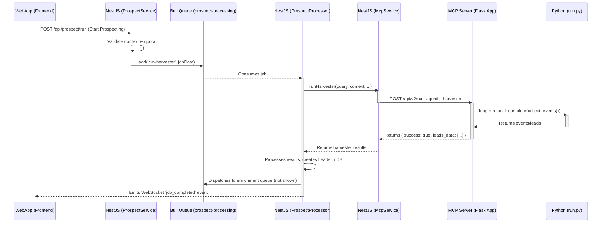

# Final Adjustments & Integration Plan

This document provides a comprehensive analysis of the bridge between the NestJS web application and the Python-based MCP (Model-Context-Protocol) server. It outlines the complete data flow, analyzes key service interactions, identifies critical issues, and provides a robust to-do list to finalize the project.

## 1. End-to-End "Start Prospecting" Flow Analysis

The "Start Prospecting" process involves a complex but well-defined sequence of operations across the entire stack.

### Flow Diagram

### Flow Description

1.  **Initiation (WebApp):** The user clicks a button on the frontend, which sends a POST request to the NestJS backend to start the prospecting process.
2.  **Job Dispatch (NestJS `ProspectService`):**
    *   The [`ProspectService`](webapp/backend/src/modules/prospect/prospect.service.ts) receives the request.
    *   It validates that the user's business context is complete and checks if they have sufficient lead generation quota.
    *   It creates a `jobData` object and adds it to the `prospect-processing` Bull queue.
3.  **Job Consumption (NestJS `ProspectProcessor`):**
    *   The [`ProspectProcessor`](webapp/backend/src/modules/queue/processors/prospect.processor.ts) picks up the job from the queue.
    *   It calls the [`McpService.runHarvester`](webapp/backend/src/modules/mcp/mcp.service.ts:616) method, passing the necessary query, context, and quota limits.
4.  **MCP Communication (NestJS `McpService`):**
    *   The [`McpService`](webapp/backend/src/modules/mcp/mcp.service.ts) acts as the primary bridge to the Python backend.
    *   The `runHarvester` method constructs a payload and sends a POST request to the `/api/v2/run_agentic_harvester` endpoint on the MCP server.
5.  **Agent Execution (Python MCP Server & Agents):**
    *   The Flask server in [`app.py`](prospect/mcp-server/app.py) receives the request at the `/api/v2/run_agentic_harvester` endpoint.
    *   It synchronously calls the `execute_agentic_pipeline` function from [`run.py`](prospect/run.py).
    *   The `execute_agentic_pipeline` function orchestrates the execution of the various Python agents (query refinement, lead search, etc.) to generate leads.
    *   The results are collected and returned as a JSON response to the `McpService`.
6.  **Result Handling (NestJS):**
    *   The `ProspectProcessor` receives the raw lead data from the `McpService`.
    *   It then calls `mcpService.processRawDataToLead` for each result to structure it.
    *   The structured leads are saved to the database with a `HARVESTED` status.
    *   A new job is dispatched to a separate `enrichment-processing` queue for each new lead.
    *   The user's lead quota is consumed.
7.  **Notification (WebSocket):** The `ProspectProcessor` emits a `job_completed` event via WebSockets to notify the frontend that the initial harvesting is complete and leads are being enriched.

---

## 2. `mcp.service.ts` Analysis

This service is the core intermediary between the NestJS application and the Python MCP server.

| Method | Endpoint | Data Sent | Expected Return | Error Handling |
| :--- | :--- | :--- | :--- | :--- |
| **`runHarvester`** | `POST /api/v2/run_agentic_harvester` | `HarvesterJobData` (query, context, limits, userId) | `AgenticHarvesterResponse` (success, job_id, leads_data, etc.) | Catches errors and falls back to a legacy `runLegacyHarvester` method, which is a significant risk. |
| **`processRawDataToLead`** | `POST /api/mcp/process-raw-to-lead` | `{ raw_data, business_context }` | A structured `LeadData` object or `null`. | Catches errors and returns `null`, logging the failure. This is a safe handling pattern. |
| **`startLeadProcessing`** | `POST /api/lead/start` | `LeadProcessingStateCreate` (lead_id, run_id, url) | Generic `any` response. | Throws a generic `Error` via the `makeRequest` helper. |
| **`getLeadStatus`** | `GET /api/lead/{lead_id}/status` | N/A | `LeadStatus` object. | Throws a generic `Error` via the `makeRequest` helper. |
| **`streamEnrichmentPipeline`** | `POST /api/v2/stream_enrichment_pipeline` | `EnrichmentJobData` (lead, context, userId, etc.) | A data stream (`response.data`). | Relies on `firstValueFrom`, which will throw an error on failure. The calling service must handle this. |
| **`updateBusinessContext`** | `POST /api/business-context` | `BusinessContextType` object or `null`. | `void` | Catches and logs the error but **does not rethrow**. This allows the app to function even if MCP sync fails. |

---

## 3. System Interaction & Problem Identification

### Communication between MCP Server and Prospect Project

*   **Entry Point:** The Flask server in [`prospect/mcp-server/app.py`](prospect/mcp-server/app.py) is the sole entry point for the NestJS backend.
*   **Execution Model:** The Flask app directly calls the `execute_agentic_pipeline` function from [`prospect/run.py`](prospect/run.py). Crucially, it does this **synchronously within the HTTP request cycle**. This means the HTTP request from NestJS to the MCP server will hang until the entire Python agent pipeline is finished.
*   **Agent Orchestration:** [`run.py`](prospect/run.py) is the main orchestrator. It enhances the user's query with business context and then executes a series of agents from `adk1/agent.py` to refine the query, search for leads, and extract structured data.
*   **The `harvester.py` script is a legacy tool.** The primary flow uses the agentic pipeline in `run.py`. The `harvester.py` script appears to be a standalone tool for direct execution and is what the `McpService` falls back to if the main agentic harvester call fails. This fallback mechanism is problematic.

### Identified Issues & Inconsistencies

1.  **Synchronous Blocking in MCP Server:** The biggest issue is that the Flask server blocks on the `/api/v2/run_agentic_harvester` endpoint. A long-running agent process will cause the HTTP request from NestJS to time out. The `McpService` has a long timeout (180s), but this is not a scalable solution. The Python server should accept the job, return a `job_id` immediately, and process the job in the background using a proper task queue (e.g., Celery, RQ).
2.  **Risky Fallback Logic:** The `McpService.runHarvester` falls back to a `runLegacyHarvester` method if the primary agentic harvester call fails. This legacy method calls a different, non-existent endpoint (`/api/harvester/run`) and likely relies on the old `harvester.py` script, creating an inconsistent and unreliable system. This fallback should be removed.
3.  **Lack of a Real Task Queue in Python:** The Python backend does not use a task queue. The "job" is processed entirely within the web request, which is not suitable for long-running, resource-intensive AI agent tasks.
4.  **Inconsistent Error Handling:** The `McpService` has varied error handling. Some methods throw errors, some return `null`, and one (`updateBusinessContext`) silently fails. A consistent error handling strategy is needed.
5.  **Redundant Lead Processing:** The `ProspectProcessor` gets harvester results, then calls `mcpService.processRawDataToLead` for each one. The agentic pipeline in `run.py` should ideally return already-structured leads, making this second processing step redundant and inefficient.

---

## 4. Final To-Do List

This to-do list outlines the critical tasks to create a robust, reliable, and scalable system.

### P0: Critical System Architecture Fixes

*   [x] **Implement a Python Task Queue:**
    *   **Task:** Refactor the Python MCP server (`app.py`) to use a task queue (e.g., Celery with Redis or RabbitMQ).
    *   **Action:** When a request hits `/api/v2/run_agentic_harvester`, the server should immediately add a job to the queue with the request payload and return a `202 Accepted` response with a `job_id`.
    *   **Reason:** This prevents HTTP timeouts and makes the system scalable. The NestJS backend will need a new endpoint to poll for job status using the `job_id`.

*   [x] **Remove Legacy Harvester Fallback:**
    *   **Task:** Delete the `runLegacyHarvester` method from [`McpService`](webapp/backend/src/modules/mcp/mcp.service.ts) and remove the `try...catch` block that calls it in `runHarvester`.
    *   **Action:** The `runHarvester` method should now directly throw an error if the call to `/api/v2/run_agentic_harvester` fails. The `ProspectProcessor` should catch this error and fail the Bull job correctly.
    *   **Reason:** The fallback is to a non-existent endpoint and creates a fragile, unpredictable system. Failing fast is better.

### P1: Process and Efficiency Improvements

*   [x] **Streamline Lead Generation:**
    *   **Task:** Modify the Python agentic pipeline (`run.py`) to perform all necessary data structuring.
    *   **Action:** The `/api/v2/run_agentic_harvester` endpoint should return fully-formed `LeadData` objects, not raw data. This will eliminate the need for the `processRawDataToLead` call in the NestJS `ProspectProcessor`.
    *   **Reason:** Reduces redundant API calls and simplifies the NestJS processor logic, making the process faster and more efficient.

*   [x] **Standardize Error Handling in `McpService`:**
    *   **Task:** Refactor all methods in [`McpService`](webapp/backend/src/modules/mcp/mcp.service.ts) to have a consistent error handling strategy.
    *   **Action:** All public methods should throw a custom, descriptive error (e.g., `McpApiError`) on failure. The `makeRequest` helper should be updated to facilitate this. The only exception is `updateBusinessContext`, whose silent failure is acceptable.
    *   **Reason:** Makes the service's behavior predictable and allows calling services (`ProspectProcessor`) to handle failures robustly.

### P2: Code Cleanup and Refinement

*   [x] **Remove Unused Legacy Code:**
    *   **Task:** Analyze and remove unused legacy methods from `McpService` related to the old lead processing flow (e.g., `processLead`, `getLeadProgress`, `updateLeadStage`).
    *   **Action:** Delete the methods and any related interfaces.
    *   **Reason:** Simplifies the codebase and removes dead code that could cause confusion.

*   [x] **Refine WebSocket Event Payloads:**
    *   **Task:** Ensure the `JobCompletedData` and `JobFailedData` WebSocket DTOs provide all necessary information for the frontend to react correctly.
    *   **Action:** Review the DTOs in [`websocket.dto.ts`](webapp/backend/src/modules/websocket/dto/websocket.dto.ts) and add any missing fields (e.g., a summary of leads generated, a more detailed error object).
    *   **Reason:** Improves the real-time user experience by providing richer feedback.
    *   **Outcome:** No changes were necessary as the existing DTOs were deemed sufficient.